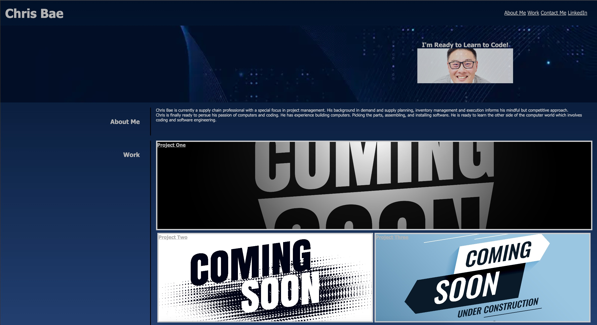

# professional-portfolio

## Description
- Objective was to create a website to share some information about myself and showcase future projects I will be creating/developing during my UCLA Bootcamp. Also opportunity to share my contact information with how to reach out to me directly.
- I built this project to take what I've been taught the first couple of weeks of bootcamp. It was hard because you can listen to the instructor but until you have actual hands on experience you won't master it.
- I learned that practice makes perfect and I need to continue to just code for practice no matter how small I think it might be.

## Usage
- Portfolio to showcase future projects and apps I will be developing during my course.
- You can use the navigation bar to be taken directly to the portion of the UI you wish to view.
- Below is a screen shot of the project.

## Website link
- https://cbae122.github.io/professional-portfolio/

## Credits
- Instructor Diarmuid - during office hours, showed how to correctly add flex to css. 
- Google for images and #code for colors.
- w3schools.com for HTML codes